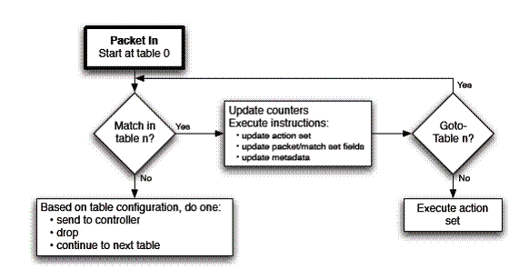

https://www.ibm.com/developerworks/cn/cloud/library/1401_zhaoyi_openswitch/

### Open vSwitch 概述
Open vSwitch（下面简称为 OVS）是由 Nicira Networks 主导的，运行在虚拟化平台（例如 KVM，Xen）上的虚拟交换机。在虚拟化平台上，OVS 可以为动态变化的端点提供 2 层交换功能，很好的控制虚拟网络中的访问策略、网络隔离、流量监控等等。


### Open vSwitch 概述
在 OVS 中, 有几个非常重要的概念：

* Bridge: Bridge 代表一个以太网交换机（Switch），一个主机中可以创建一个或者多个 Bridge 设备。

* Port: 端口与物理交换机的端口概念类似，每个 Port 都隶属于一个 Bridge。

* Interface: *连接到 Port 的网络接口设备*。在通常情况下，Port 和 Interface 是一对一的关系, 只有在配置 Port 为 bond 模式后，Port 和 Interface 是一对多的关系。

* Controller: OpenFlow 控制器。OVS 可以同时接受一个或者多个 OpenFlow 控制器的管理。

* datapath: 在 OVS 中，datapath 负责执行数据交换，也就是把从接收端口收到的数据包在流表中进行匹配，并执行匹配到的动作。

* Flow table: 每个 datapath 都和一个“flow table”关联，当 datapath 接收到数据之后， OVS 会在 flow table 中查找可以匹配的 flow，执行对应的操作, 例如转发数据到另外的端口。


### 基于 Open vSwitch 的 OpenFlow 实践

OpenFlow 是用于管理交换机流表的协议，ovs-ofctl 则是 OVS 提供的命令行工具。在没有配置 OpenFlow 控制器的模式下，用户可以使用 ovs-ofctl 命令通过 OpenFlow 协议去连接 OVS，创建、修改或删除 OVS 中的流表项，并对 OVS 的运行状况进行动态监控。




### Flow语法说明

在 OpenFlow 的白皮书中，Flow 被定义为某个特定的网络流量。例如，一个 TCP 连接就是一个 Flow，或者从某个 IP 地址发出来的数据包，都可以被认为是一个 Flow。支持 OpenFlow 协议的交换机应该包括一个或者多个流表，流表中的条目包含：数据包头的信息、匹配成功后要执行的指令和统计信息。

当数据包进入 OVS 后，会将数据包和流表中的流表项进行匹配，如果发现了匹配的流表项，则执行该流表项中的指令集。相反，如果数据包在流表中没有发现任何匹配，OVS 会通过控制通道把数据包发到 OpenFlow 控制器中。

在 OVS 中，流表项作为 ovs-ofctl 的参数，采用如下的格式：字段=值。如果有多个字段，可以用逗号或者空格分开。一些常用的字段列举如下：


| 字段名称  |  说明  |
|:--------:|:---------:|
|n_port=port|	传递数据包的端口的 OpenFlow 端口编号\
|dl_vlan=vlan|	数据包的 VLAN Tag 值，范围是 0-4095，0xffff 代表不包含 VLAN Tag 的数据包|
|dl_src= <MAC\> dl_dst=<MAC\>|匹配源或者目标的 MAC 地址 01:00:00:00:00:00/01:00:00:00:00:00 代表广播地址 00:00:00:00:00:00/01:00:00:00:00:00 代表单播地址|
|dl_type=ethertype|	匹配以太网协议类型，其中： dl_type=0x0800 代表 IPv4 协议 dl_type=0x086dd 代表 IPv6 协议 dl_type=0x0806 代表 ARP 协议|
|nw_src=ip[/netmask] nw_dst=ip[/netmask]|	当 dl_typ=0x0800 时，匹配源或者目标的 IPv4 地址，可以使 IP 地址或者域名|
|nw_proto=proto|	和 dl_type 字段协同使用。当 dl_type=0x0800 时，匹配 IP 协议编号当 dl_type=0x086dd 代表 IPv6 协议编号|
|table=number|指定要使用的流表的编号，范围是 0-254。在不指定的情况下，默认值为 0。通过使用流表编号，可以创建或者修改多个 Table 中的 Flow|
|reg<idx>=value[/mask]|	交换机中的寄存器的值。当一个数据包进入交换机时，所有的寄存器都被清零，用户可以通过 Action 的指令修改寄存器中的值|


对于 add−flow，add−flows 和 mod−flows 这三个命令，还需要指定要执行的动作：actions=[target][,target...]

一个流规则中可能有多个动作，按照指定的先后顺序执行。

**output:port: 输出数据包到指定的端口。port 是指端口的 OpenFlow 端口编号**

**mod_vlan_vid: 修改数据包中的 VLAN tag**

**strip_vlan: 移除数据包中的 VLAN tag**

mod_dl_src/ mod_dl_dest: 修改源或者目标的 MAC 地址信息

mod_nw_src/mod_nw_dst: 修改源或者目标的 IPv4 地址信息

resubmit:port: 替换流表的 in_port 字段，并重新进行匹配

load:value−>dst[start..end]: 写数据到指定的字段


### 实践操作 OpenFlow 命令

创建一个新的 OVS 交换机

```
$ ovs-vsctl add-br ovs-switch
```

创建一个端口 p0，设置端口 p0 的 OpenFlow 端口编号为 100（如果在创建端口的时候没有指定 OpenFlow 端口编号，OVS会自动生成一个）。
```
$ ovs-vsctl add-port ovs-switch p0 -- set Interface p0 ofport_request=100
```
>添加过程中会出现报错
ovs-vsctl: Error detected while setting up 'p1'.  See ovs-vswitchd log for details.因为其无物理网卡，无法确认类型

设置网络接口设备的类型为“internal”。对于 internal 类型的的网络接口，OVS 会同时在 Linux 系统中创建一个可以用来收发数据的模拟网络设备。我们可以为这个网络设备配置 IP 地址、进行数据监听等等。

```
$ ovs-vsctl set Interface p0 type=internal
```
```
$ ethtool -i p0
driver: openvswitch
version:
firmware-version:
bus-info:
supports-statistics: no
supports-test: no
supports-eeprom-access: no
supports-register-dump: no
```

为了避免网络接口上的地址和本机已有网络地址冲突，我们可以创建一个虚拟网络空间 ns0，把 p0 接口移入网络空间 ns0，并配置 IP 地址为 192.168.1.100

>操作网络虚拟空间：
ip netns exec [namespace名称] cmd


```
#创建一个namespace ns0
$ ip netns add ns0
#将p0 迁移至ns0 虚拟网络空间内
$ ip link set p0 netns ns0
#配置 IP 地址为 192.168.1.100
$ ip netns exec ns0 ip addr add 192.168.1.100/24 dev p0
$ ip netns exec ns0 ifconfig p0 promisc up

```
|端口|	说明|
|:--------:|:---------:|
|p0        |	IP 地址: 192.168.1.100/24 网络名称空间: ns0 网络接口 MAC 地址: 66:4e:cc:ae:4d:20 OpenFlow Port Number: 100
|p1	|IP 地址: 192.168.1.101/24 网络名称空间: ns1 网络接口 MAC 地址:46:54:8a:95:dd:f8 OpenFlow Port Number: 101|
|p2|IP 地址: 192.168.1.102/24, 网络名称空间: ns2 网络接口 MAC 地址:86:3b:c8:d0:44:10 OpenFlow Port Number: 102|
### 使用 ovs-ofctl 创建并测试 OpenFlow 命令

1. 查看 Open vSwitch 中的端口信息。从输出结果中，可以获得交换机对应的 datapath ID （dpid），以及每个端口的 OpenFlow 端口编号，端口名称，当前状态等等。

```
$ ovs-ofctl show ovs-switch

OFPT_FEATURES_REPLY (xid=0x2): dpid:00001232a237ea45
n_tables:254, n_buffers:256
capabilities: FLOW_STATS TABLE_STATS PORT_STATS QUEUE_STATS ARP_MATCH_IP
actions: OUTPUT SET_VLAN_VID SET_VLAN_PCP STRIP_VLAN SET_DL_SRC SET_DL_DST
SET_NW_SRC SET_NW_DST SET_NW_TOS SET_TP_SRC SET_TP_DST ENQUEUE
 100(p0): addr:54:01:00:00:00:00
     config:     PORT_DOWN
     state:      LINK_DOWN
     speed: 0 Mbps now, 0 Mbps max
 101(p1): addr:54:01:00:00:00:00
     config:     PORT_DOWN
     state:      LINK_DOWN
     speed: 0 Mbps now, 0 Mbps max
 102(p2): addr:54:01:00:00:00:00
     config:     PORT_DOWN
     state:      LINK_DOWN
     speed: 0 Mbps now, 0 Mbps max
 LOCAL(ovs-switch): addr:12:32:a2:37:ea:45
     config:     0
     state:      0
     speed: 0 Mbps now, 0 Mbps max
OFPT_GET_CONFIG_REPLY (xid=0x4): frags=normal miss_send_len=0
```
如果想获得网络接口的 OpenFlow 编号，也可以在 OVS 的数据库中查询
```
$ ovs-vsctl get Interface p0 ofport
100
```

查看 datapath 的信息

```
$ ovs-dpctl show

system@ovs-system:
lookups: hit:12173 missed:712 lost:0
flows: 0
port 0: ovs-system (internal)
port 1: ovs-switch (internal)
port 2: p0 (internal)
port 3: p1 (internal)
port 4: p2 (internal)
```

2. 屏蔽数据包
屏蔽所有进入 OVS 的以太网广播数据包

```
$ ovs-ofctl add-flow ovs-switch "table=0, dl_src=01:00:00:00:00:00/01:00:00:00:00:00, actions=drop"

```
屏蔽 STP 协议的广播数据包

```
$ ovs-ofctl add-flow ovs-switch "table=0, dl_dst=01:80:c2:00:00:00/ff:ff:ff:ff:ff:f0, actions=drop"

```

3. 修改数据包
添加新的 OpenFlow 条目，修改从端口 p0 收到的数据包的源地址为 9.181.137.1

```
$ ovs-ofctl add-flow ovs-switch "priority=1 idle_timeout=0,\
    in_port=100,actions=mod_nw_src:9.181.137.1,normal"
```
从端口 p0（192.168.1.100）发送测试数据到端口 p1（192.168.1.101）

```
$ ip netns exec ns0 ping 192.168.1.101
```
在接收端口 p1 监控数据，发现接收到的数据包的来源已经被修改为 9.181.137.1
>tcpdump -i p1  icmp 监听p1端口的icmp协议

```
$ ip netns exec ns1 tcpdump -i p1 icmp
tcpdump: verbose output suppressed, use -v or -vv for full protocol decode
listening on p1, link-type EN10MB (Ethernet), capture size 65535 bytes
15:59:16.885770 IP 9.181.137.1 > 192.168.1.101: ICMP echo request, id 23111, seq 457, length 64
15:59:17.893809 IP 9.181.137.1 > 192.168.1.101: ICMP echo request, id 23111, seq 458, length 64
```
4.重定向数据包
添加新的 OpenFlow 条目，重定向所有的 ICMP 数据包到端口 p2
```
$ ovs-ofctl add-flow ovs-switch idle_timeout=0,dl_type=0x0800,nw_proto=1,actions=output:102

```
从端口 p0 （192.168.1.100）发送数据到端口 p1（192.168.1.101）
```
$ ip netns exec ns0 ping 192.168.1.101
```

在端口 p2 上监控数据，发现数据包已被转发到端口 p2
```
$ ip netns exec ns3 tcpdump -i p2 icmp
tcpdump: verbose output suppressed, use -v or -vv for full protocol decode
listening on p2, link-type EN10MB (Ethernet), capture size 65535 bytes
16:07:35.677770 IP 192.168.1.100 > 192.168.1.101: ICMP echo request, id 23147, seq 25, length 64
16:07:36.685824 IP 192.168.1.100 > 192.168.1.101: ICMP echo request, id 23147, seq 26, length 64

```
5. 修改数据包的 VLAN Tag

除了使用“ping”、“tcpdump”和“iperf” 等 Linux 命令以外，我们也可以使用 OVS 提供的 ovs-appctl ofproto/trace 工具来测试 OVS 对数据包的转发状况。
ovs-appctl ofproto/trace 可以用来生成测试用的模拟数据包，并一步步的展示 OVS 对数据包的流处理过程。在以下的例子中，我们演示一下如何使用这个命令：

修改端口 p1 的 *VLAN tag* 为 101，使端口 p1 成为一个隶属于 VLAN 101 的端口
```
$ ovs-vsctl set Port p1 tag=101
```
现在由于端口 p0 和 p1 属于不同的 VLAN，它们之间无法进行数据交换。我们使用 ovs-appctl ofproto/trace 生成一个从端口 p0 发送到端口 p1 的数据包，这个数据包不包含任何 VLAN tag，并观察 OVS 的处理过程

```
$ ovs-appctl ofproto/trace ovs-switch in_port=100,dl_src=66:4e:cc:ae:4d:20,dl_dst=46:54:8a:95:dd:f8 -generate

Flow:metadata=0,in_port=100,vlan_tci=0x0000,dl_src=66:4e:cc:ae:4d:20,
 dl_dst=46:54:8a:95:dd:f8,dl_type=0x0000
Rule: table=0 cookie=0 priority=0
OpenFlow actions=NORMAL
no learned MAC for destination, flooding
Final flow: unchanged
Relevant fields: skb_priority=0,in_port=100,vlan_tci=0x0000/0x1fff,\
dl_src=66:4e:cc:ae:4d:20,dl_dst=46:54:8a:95:dd:f8,dl_type=0x0000,nw_frag=no
Datapath actions: 4,1
```

在第一行输出中，“Flow:”之后的字段描述了输入的流的信息。由于我们没有指定太多信息，所以多数字段 （例如 dl_type 和 vlan_tci）被 OVS 设置为空值。
在第二行的输出中，“Rule:” 之后的字段描述了匹配成功的流表项。
在第三行的输出中，“OpenFlow actions”之后的字段描述了实际执行的操作。

最后一段以”Final flow”开始的字段是整个处理过程的总结，“Datapath actions: 4,1”代表数据包被发送到 datapath 的 4 和 1 号端口。
创建一条新的 Flow：对于从端口 p0 进入交换机的数据包，如果它不包含任何 VLAN tag，则自动为它添加 VLAN tag 101

```
$ ovs-ofctl add-flow ovs-switch "priority=3,in_port=100,dl_vlan=0xffff,\
actions=mod_vlan_vid:101,normal"
```

### 其他 OpenFlow 常用的操作

查看交换机中的所有 Table
```
ovs-ofctl dump-tables br
```

查看交换机中的所有流表项
```
ovs−ofctl dump−flows br
```

删除编号为 100 的端口上的所有流表项
```
ovs-ofctl del-flows ovs-switch "in_port=100"
```

查看交换机上的端口信息
```
ovs-ofctl show ovs-switch
```


```
ovs-ofctl add-flow br2 "in_port=14,dl_vlan=200,actions=strip_vlan,output:1"
[root@client ~]# ovs-ofctl add-flow br2 "in_port=1,dl_vlan=0xffff,actions=mod_vlan_vid:200,output:14"
```
