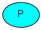
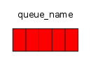
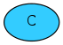
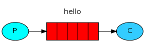
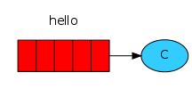

### Introduction
[官方文档](http://www.rabbitmq.com/tutorials/tutorial-one-python.html)
RabbitMQ是一个消息代理:它接受和转发消息。你可以把它想象成一个邮局:当你把你想要投寄的邮件放在一个邮箱里时，你可以确定收信人先生或女士最终会把邮件寄给你的收件人。在这个类比中，RabbitMQ是一个邮箱、一个邮局和一个邮递员。
RabbitMQ与邮局的主要区别在于它不处理纸张，而是接收、存储和转发二进制数据块——消息。

RabbitMQ和消息传递通常使用一些术语。

1. Producing仅仅意味着发送。发送消息的程序是生产者(producer)



2. 队列是位于RabbitMQ内的邮箱的名称。尽管消息流经RabbitMQ和您的应用程序，但它们只能存储在队列中。队列只受主机的内存和磁盘限制，它本质上是一个大的消息缓冲区。许多生产者可以向一个队列发送消息，许多消费者可以尝试从一个队列接收数据。这是我们表示队列的方式:


3. Consuming与接受含义相似。消费者(consumer)是一个主要等待接收消息的程序:




### using the Pika Python client

在本教程的这一部分中，我们将用Python编写两个小程序;发送单个消息的生产者(发送方)和接收消息并将其打印出来的消费者(接收方)。这是一个信息传递的"Hello World"。在下面的图表中，“P”是我们的生产者，“C”是我们的消费者。中间的框是一个队列

生产者向“hello”队列发送消息。使用者从该队列接收消息。

>Python代码实现通过PiKa库，可以通过pip install pika 进行安装

#### Sending

我们的第一个程序send.py将向队列发送一条消息。我们需要做的第一件事是与RabbitMQ服务器建立连接。

```
#!/usr/bin/env python
import pika

connection = pika.BlockingConnection(pika.ConnectionParameters('localhost'))
channel = connection.channel()
```

其默认的账户为guset 密码为guest。在连接之前需要对其进行权限设置，确保其可以连接vhost。我们现在连接到本地机器上的代理——因此是localhost。如果我们想连接到另一台机器上的代理，我们只需在这里指定它的名称或IP地址。
在发送消息之前，需要确保接收队列存在。如果将消息发送到不存在的位置，RabbitMQ将删除消息。
创建一个hello队列，消息将发送到该队列:
```
channel.queue_declare(queue='hello')
```

现在我们准备发送一条消息。我们的第一个消息将只包含一个字符串Hello World!我们想把它发送到hello队列。在RabbitMQ中，消息永远不能直接发送到队列，它总是需要通过交换。现在我们只需要知道如何使用由空字符串标识的默认交换。这个交换是特殊的——它允许我们精确地指定消息应该放在哪个队列中。队列名称需要在routing_key参数中指定:

```
channel.basic_publish(exchange='',
                      routing_key='hello',
                      body='Hello World!')
print(" [x] Sent 'Hello World!'")

```

在退出程序之前，我们需要确保网络缓冲区已刷新，并且我们的消息实际上已传递给RabbitMQ。我们可以轻轻地关闭连接。

```
connection.close()
```

#### Receiving


我们的第二个程序将接收来自队列的消息并将它们打印在屏幕上。同样，首先我们需要连接到RabbitMQ服务器。负责连接Rabbit的代码与之前一样。
与前面一样，下一步是确保队列存在。使用queue_declare创建一个队列,我们可以任意多次运行该命令，而且只会创建一个。

```
channel.queue_declare(queue='hello')
```
您可能会问我们为什么再次声明队列——我们已经在前面的代码中声明了它。如果我们确信队列已经存在，就可以避免这种情况。例如，如果send.py以前运行过,但我们还不确定先运行哪个程序。在这种情况下，最好在两个程序中重复声明队列。

从队列接收消息更为复杂。它通过向队列订阅回调函数来工作。每当我们收到消息时，Pika库都会调用这个回调函数。在我们的示例中，此函数将在屏幕上打印消息的内容。
```
def callback(ch, method, properties, body):
    print(" [x] Received %r" % body)
```

接下来，我们需要告诉RabbitMQ这个特定的回调函数应该接收来自hello队列的消息

```
channel.basic_consume(callback,
                      queue='hello',
                      no_ack=True)
```

最后，我们进入一个永无止境的循环，等待数据并在必要时运行回调。

```
print(' [*] Waiting for messages. To exit press CTRL+C')
channel.start_consuming()
```
