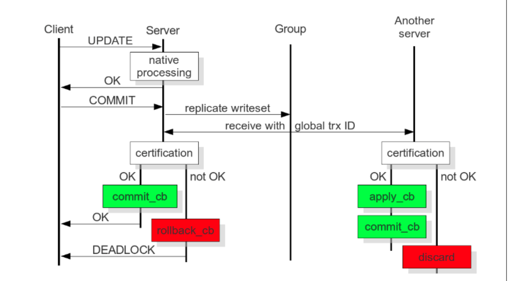

##浅谈MariaDB Galera Cluster架构

MariaDB
 MariaDB 是由原来 MySQL 的作者Michael Widenius创办的公司所开发的免费开源的数据库服务器，MariaDB是同一MySQL版本的二进制替代品, 当前最新版本10.2.6。与 MySQL 相比较，MariaDB 支持更多的存储引擎：Maria 存储引擎、PBXT 存储引擎、XtraDB 存储引擎、InnoDB 存储引擎、FederatedX 存储引擎、Tokudb存储引擎【1】
优越性
   更快的复制查询处理
   线程池
   更少的警告和bug
   运行速度更快
   更多的 Extensions (More index parts, new startup options etc)
   更好的功能测试
   数据表消除
   慢查询日志的扩展统计
   支持对 Unicode 的排序

### 为什么Galera是最好的MySQL HA解决方案呢?
Galera Cluster设置仍然使用轮询来做健康检测——这比MMM好在哪里呢?
答案在于主从复制怎样是运作的。对于标准版的MySQL，对master的写操作被记录于一个二进制的日志。Slave会在之后复制二进制日志中的查询。查询在写服务器上运行与在其它节点上运行时刻之间，总是会有一个延迟。它是异步的。
MySQL异步复制有下面的问题：
    * slave服务器的数据集总是落后于master服务器。
    * MySQL复制很慢——它从二进制日志回访事务。

对于Galera,事务是在它们被提交之前被所有节点确认。如果一个事务在一个节点失败了，那个节点将立刻从群集中移除。换句话说，Galera主从复制是同步的。你 永远也不会丢失事务——没有延迟 (而且Galera的 基于行的复制大约要快5倍速)。

### Galera Cluster
Galera Cluster是MariaDB的一个双活多主集群，当前最新版本10.0.30，其可以使得MariDB的所有节点保持同步，Galera为MariaDB提供了同步复制（相对于原生的异步复制），因此其可以保证HA，且其当前仅支持XtraDB/InnoDB存储引擎（扩展支持MyISAM），并且只可在Linux下使用。
Galera Cluster拥有以下特性：

   * 真正的多主架构，任何节点都可以进行读写
   * 同步复制，各节点间无延迟且节点宕机不会导致数据丢失
   * 紧密耦合，所有节点均保持相同状态，节点间无不同数据
   * 无需主从切换操作或使用VIP
   * 热Standby，在Failover过程中无停机时间（由于不需要Failover）
   * 自动节点配置，无需手工备份当前数据库并拷贝至新节点
   * 支持InnoDB存储引擎
   * 对应于透明，无需更改应用或是进行极小的更改
   * 无需进行读写分离

其主要思想是 **在不出现冲突的背景下事务正常执行并持续到commit为止 ；当客户端发起commit命令时（此时仍然没有发生真正的commit），所有本事务内对数据库的改动与改动数据行的主键都会被搜集到一个写入集（writeset）中，该写入集随后会被复制到其他节点，该写入集会在每个节点上使用搜集到的主键进行确认性认证测试（包括被“提交”事务的当前节点）来判断该写入集是否可以被应用。如果认证测试失败，写入集会被丢弃并且原始事务会被回滚，如果认证成功，事务会被提交并且写入集会被在剩余节点进行应用**。

以上的认证测试在Galera集群中的实现取决于全局事务顺序，每个事务在复制期间都会被指派一个全局顺序序列；当一个事务到达提交点时，该事务会知道当前与该事务不冲突的最新已提交事务的顺序序号，在这两个事务的全局顺序序列之间的间隔是不确定区域，在该区域间的事务相互是“看不到”对方的影响的，但所有在这间隔之间的事务都会被进行主键冲突检测（如果发现冲突认证测试就会失败）。

Galera Cluster提供了并行的复制机制，能实现同步的，多主的复制方式。因此具有很多实用特性：

* 可以在任意节点上进行读写
* 自动剔除故障节点
* 自动加入新节点
* 真正行级别的并发复制
* 客户端连接跟操作单数据库的体验一致

在数据复制方面有同步和异步两种方式，而同步方式的优势十分明显：

高可用（当节点宕机时数据不会丢失，数据复制一致性高，实现不复杂）；
具有较高的性能；
跨集群。但是缺点是随着节点数量的增加，其事务的响应时间，冲突的概率和死锁率会呈指数增长。（因此像MySQL和PostgreSQL都采用异步复制方式）

为克服同步复制的的缺点，现在主要的技术包括：Group Communication，Write-sets，Database State Machine和Transaction Reordering。

 *Galera Cluster* 使用一种称为Certification-based Replication的策略实现集群同步制，Certification-based Replication综合使用了Group Communication和Transaction Reordering技术。具体来说：事务可以在任意单节点上执行或者复制，但是在事务在提交时，会运行一个协调认证程序来保证事务的全局一致性，它借助广播服务，建立一个全局的并发事务。
Certification-based Replication的主要思想是数据库中的任何事务在未到达提交点（commit point）时，会假设没有任何冲突。在事务commit发生之前，这个事务将会引起的所有数据库变化和所变行的主键都会被收集到一个write-set中。然后会把这个write-set发送到集群中的其它节点上。有了write-set，此时集群中所有的节点会使用主键执行一个certification test，如果失败则丢弃write-set并且回滚事务，如果成功则事务会被提交并将write-set应用到集群中其余的节点。而Galera Cluster中使用Certification-based Replication策略则依赖于一个全局的事务序列。

【1】tokudb是一个应用在mysql和MariaDB中的存储引擎，它使用索引加快查询速度，具有高扩展性，并支持hot scheme modification。
       特点：

插入性能快20~80倍；
压缩数据减少存储空间；
数据量可以扩展到几个TB；
不会产生索引碎片；
支持hot column addition ， hot indexing， mvcc；

如何考虑使用：

如果要存储blob，不要使用tokuDB，因为他的记录不能太大；
如果记录数过亿，使用tokuDB；
如果注重update的性能，不要使用tokuDB，他没有innodb快；
如果要存储旧的记录，使用tokuDB；
如果要缩小数据占用的存储空间，使用tokuDB；
