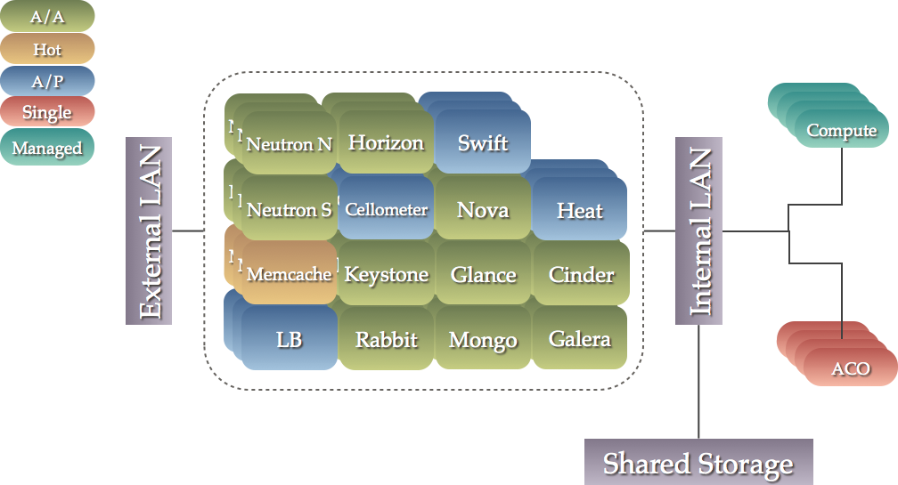
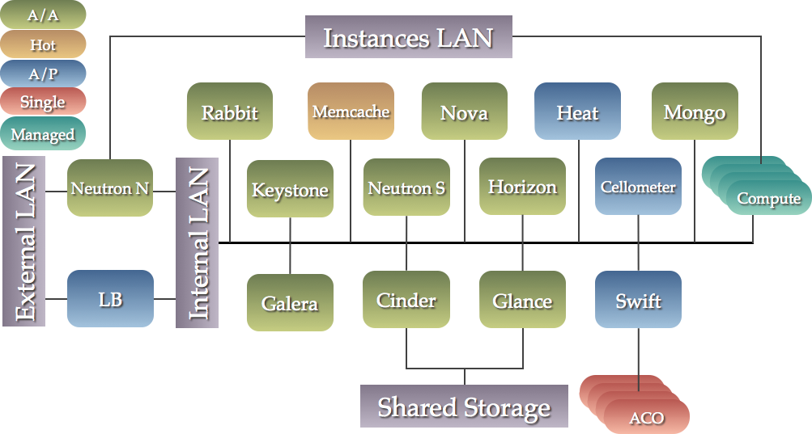
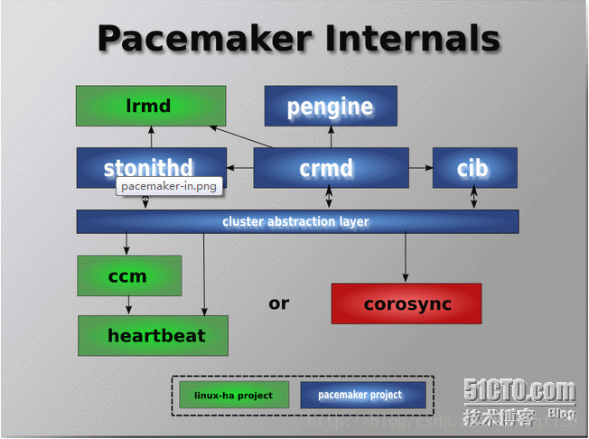

## 控制节点的配置（）

###高可用控制节点（highly available controllers）概述

OpenStack是一组服务，其通过HTTP(s)API呈现给最终用户。此外，对于您自己的内部使用，OpenStack需要一个SQL数据库服务器和AMQP。所有组件运行的物理服务器称为controllers。这个模块化的OpenStack体系结构允许您复制所有组件并在不同的控制器上运行它们。通过使所有组件冗余，可以使OpenStack高可用性成为可能。
一般来说，我们可以将所有OpenStack组件分为三类:

1. OpenStack API:使用python编写的HTTP(s)无状态服务的API，易于复制，并且很容易实现负载平衡。
2. SQL关系数据库服务器提供其他组件使用的有状态类型。支持的数据库有MySQL、MariaDB和PostgreSQL。使SQL数据库冗余是很复杂的。
3. 高级消息队列协议(AMQP)提供了OpenStack内部有状态通信服务。

>corosync是集群框架引擎程序，pacemaker是高可用集群资源管理器，crmsh是pacemaker的命令行工具。

### 常见的部署架构
我们推荐两种使OpenStack高可用的主要体系结构。在集群管理的服务集合中，体系结构各不相同。两者都使用集群管理器(如Pacemaker或Veritas)来协调跨一组机器的各种服务的操作。因为我们关注的是FOSS，所以我们将其称为“Pacemaker architectures”。

传统上，Pacemaker architectures被定位为一个完整的解决方案。但是，随着OpenStack服务的成熟，它们越来越能够在active/active配置中运行，并且能够优雅地应对其所依赖的API的丢失。
考虑到这一点，一些供应商将Pacemake的使用限制在必须以active/passive模式操作的服务（cinder-volume）、具有多个状态的服务(for example, Galera),和具有复杂引导过程的服务(such as RabbitMQ)。
大多数服务，不需要真正的编排，都是由每个节点上的系统来处理的。这种方法避免了与集群协调服务升级或位置更改的需要，并且具有更容易伸缩的额外优势。然而，它通常需要添加一个企业监控解决方案，用于获取集中故障报告。例如Nagios或Sensu。

#### Pacemaker 架构

##### 什么是集群管理器（cluster manager）?

集群的核心是分布式有限状态机，能够跨一组机器协调相关服务的启动和恢复。即使是能够在一台或多台机器上经受失败考验的分布式或复制应用程序，也可以从集群管理器获益，因为集群管理器具有以下功能:

1. 知晓在堆栈中的应用程序
2. 知晓机器中的实例
3. 一个共享的实现和quorum的计算
4. 通过隔离实现数据完整性(无响应的流程并不意味着它什么都不做)
5. 自动恢复失败的实例

##### 部署风格
可以部署三种不同风格的Pacemaker体系结构。无论您选择哪种类型，我们建议集群至少包含三个节点，以便您可以利用Quorum。
当故障导致集群分裂为两个或多个分区时，Quorum就变得非常重要。在这种情况下，您希望系统中的大多数成员确保少数成员真正死亡并继续托管资源。对于两个节点的集群，没有哪一方占多数，您可能会遇到这样的情况:双方相互隔离，或者双方都运行相同的服务。这可能导致数据损坏。拥有偶数个宿主的集群也面临着类似的问题。单个网络故障很容易导致N:N分裂，其中任何一方都不保留多数。因此，我们建议在进行扩展时使用奇数个集群成员。最多可以有16个集群成员(目前受corosync扩展到更高级别的能力限制)。在极端情况下，32个甚至64个节点都是可能的。然而，这并没有得到很好的测试。

###### 1-Collapsed（折叠）
在Collapsed配置中，有一个由3个或更多节点组成的集群，每个组件都在此集群上运行。这个场景的优点是需要更少(如果更强大)的机器。此外，作为单个集群的一部分，可以精确地建模组件之间的排序依赖关系。这个场景如下所示。

如果您喜欢拥有更少但更强大的box，则您可以选择此选项。
这是最常见的选项，也是我们在这里记录的。

###### 2-Segregated (隔离)

在此配置中，每个服务在一个由3个或更多节点组成的专用集群中运行。
这种方法的好处是组件之间的物理隔离以及为特定组件增加容量的能力。
如果您想拥有更多但功能更少的box，那么您可以选择这个选项。
这个场景可以如下图所示，下面的每个框表示一个由三个或更多来宾组成的集群。

###### 3-Mixed (混合)
对于一个或多个可能成为瓶颈的组件，也可以采用隔离(Segregated)方法，其余的组件使用折叠(Collapsed)方法。

##### 代理服务器（Proxy server）
这个堆栈中的几乎所有服务都可以通过代理获益。使用代理服务器可以提供以下功能

1. 载荷分布

许多服务可以以活动/活动的方式工作，但是，它们通常需要一个外部机制来将请求分发到可用的实例上。代理服务器可以承担这项任务

2. API隔离

通过通过代理发送所有API访问，您可以清楚地识别服务之间的依赖关系。如果需要，您还可以将它们移动到本地主机以外的位置以增加容量。

3. 添加/删除节点的简化过程

由于所有API访问都指向代理，因此添加或删除节点对其他服务的配置没有影响。这在升级场景中非常有用，在此场景中，可以在隔离配置和测试一组全新的机器，然后告诉代理将实例进行迁移。

4. 提高故障检测
可以将代理配置为检测服务故障的二级机制。它甚至可以配置为查找处于降级状态的节点(例如在复制中太落后)，并将它们从循环中移除。

以下组件目前无法从代理服务器的使用中获益

* RabbitMQ
* Memcached
* MongoDB

通常，我们使用循环在活动/活动服务的实例之间分配负载。另外，Galera使用粘贴表选项来确保进入虚拟IP (VIP)的连接只指向一个可用的后端。这有助于避免锁争用和防止死锁，尽管Galera可以运行active/active。与httpchk选项结合使用，这确保只允许与对等节点同步的节点处理请求。

#### Pacemaker cluster stack

Pacemaker集群堆栈是Linux平台上最先进的高可用性和负载平衡堆栈。Pacemaker用于使OpenStack基础设施高度可用。Pacemaker依赖Corosync消息传递层进行可靠的集群通信。
Corosync实现Totem单环排序和成员协议。
它还向Pacemaker提供基于UDP和InfiniBand的消息传递、quorum和集群成员身份。Pacemaker本身并不理解它管理的应用程序。

相反，它依赖于资源代理(resource agents, RAs)，这些脚本封装了如何启动、停止和检查集群管理的每个应用程序的健康状况的知识。这些代理必须符合OCF、SysV Init、Upstart或Systemd标准之一。

Pacemaker附带了大量的OCF代理(例如管理MySQL数据库、虚拟IP地址和RabbitMQ的代理)，但也可以使用系统上已经安装的任何代理，并且可以使用自己的代理进行扩展(请参阅开发指南)。

1. Heartbeat项目最初的消息通信层被独立为新的 Heartbeat项目，新的 Heartbeat只负责维护集群各节点的信息以及它们之间的心跳通信，通常将 Pacemaker与 Heartbeat或者 Corosync共同组成集群管理软件， Pacemaker利用Heartbeat或者Corosync提供的节点及节点之间的心跳信息来判断节点状态。
2. Cluster Clue
Cluster Clue 相当于一个中间层，它用来将Heartbeat和Pacemaker关联起来，主要包含两个部分，即本地资源管理器（Local Resource Manager，LRM）和Fencing设备（Shoot The Other Node In The Head，STONITH）
3. Resource Agent
资源代理（Resource Agent，RA）是用来控制服务的启停，监控服务状态的脚本集合，这些脚本会被位于本节点上的LRM调用从而实现各种资源的启动、停止、监控等操作。
4. pacemaker
Pacemaker是整个高可用集群的控制中心，用来管理整个集群的资源状态行为，客户端通过 pacemaker来配置、管理、监控整个集群的运行状态。Pacemaker是一个功能非常强大并支持众多操作系统的开源集群资源管理器，Pacemaker支持主流的 Linux系统，如 Redhat的 RHEL系列、 Fedora系列、 openSUSE系列、Debian系列、 Ubuntu系列和 centos系列，这些操作系统上都可以运行 Pacemaker并将其作为集群资源管理器。

##### 安装包

在任何打算成为Pacemaker集群一部分的主机上，通过Corosync消息传递层建立集群通信。这涉及到安装以下包(以及包管理器通常自动安装的依赖包):

pacemaker
pcs (CentOS or RHEL) or crmsh
corosync
fence-agents (CentOS or RHEL) or cluster-glue
resource-agents
libqb0

#### HAProxy

HAProxy为TCP或HTTP应用程序提供了一个快速可靠的HTTP反向代理和负载平衡器。它特别适用于在非常高的负载下web，同时需要持久化或第7层处理。它实际上支持与最新硬件的数万个连接。HAProxy的每个实例都将其前端配置为只接受虚拟IP (VIP)地址的连接。HAProxy后端(终止点)是用于负载平衡的实例的所有IP地址的列表。

>HAProxy是免费、极速且可靠的用于为TCP和基于HTTP应用程序提供高可用、负载均衡和代理服务的解决方案，尤其适用于高负载且需要持久连接或7层处理机制的web站点。HAProxy还可以将后端的服务器与网络隔离，起到保护后端服务器的作用。HAProxy的负载均衡能力虽不如LVS，但也是相当不错，而且由于其工作在7层，可以对http请求报文做深入分析，按照自己的需要将报文转发至后端不同的服务器（例如动静分离），这一点工作在4层的LVS无法完成。

#### Memcached

Memcached是一种通用的分布式内存缓存系统。它通过缓存RAM中的数据和对象来加速动态数据库驱动的网站，以减少必须读取外部数据源的次数。Memcached是一个内存缓存，大多数OpenStack服务都可以使用它来存储短暂的数据。
HAProxy不处理对Memcached的访问，因为复制访问目前处于实验状态。相反，OpenStack服务必须提供运行Memcached的主机的完整列表。
Memcached客户端实现了散列以平衡实例之间的对象。实例的失败只会影响一部分对象，客户端会自动将其从实例列表中删除。SLA是几分钟。
