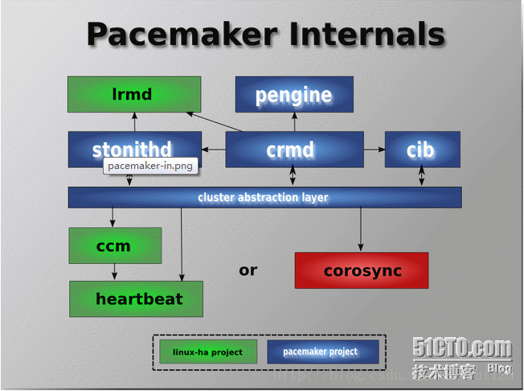

1.ccm组件（Cluster Consensus Menbership Service）：作用，承上启下，监听底层接受的心跳信息，当监听不到心跳信息的时候就重新计算整个集群的票数和收敛状态信息，并将结果转递给上层，让上层做出决定采取怎样的措施，ccm还能够生成一个各节点状态的拓扑结构概览图，以本节点做为视角，保证该节点在特殊情况下能够采取对应的动作。

2.crmd组件（Cluster Resource Manager，集群资源管理器，也就是pacemaker）：实现资源的分配，资源分配的每个动作都要通过crm来实现，是核心组建，每个节点上的crm都维护一个cib用来定义资源特定的属性，哪些资源定义在同一个节点上。

3.cib组件（集群信息基库，Cluster Infonation Base）：是XML格式的配置文件，在内存中的一个XML格式的集群资源的配置文件，主要保存在文件中，工作的时候常驻在内存中并且需要通知给其它节点，只有DC上的cib才能进行修改，其他节点上的cib都是拷贝DC上。配置cib文件的方法有，基于命令行配置和基于前台的图形界面配置。

4.lrmd组件（Local Resource Manager，本地资源管理器）：用来获取本地某个资源的状态，并且实现本地资源的管理，如当检测到对方没有心跳信息时，来启动本地的服务进程等。

5.pengine组件：

PE（Policy Engine）：策略引擎，来定义资源转移的一整套转移方式，但只是做策略者，并不亲自来参加资源转移的过程，而是让TE来执行自己的策略。

TE（Transition Engine）： 就是来执行PE做出的策略的并且只有DC上才运行PE和TE。

6.stonithd组件

STONITH(Shoot The Other Node in the Head，”爆头“)， 这种方式直接操作电源开关，当一个节点发生故障时，另 一个节点如果能侦测到，就会通过网络发出命令，控制故障节点的电源开关，通过暂时断电，而又上电的方式使故障节点被重启动， 这种方式需要硬件支持。

STONITH应用案例（主从服务器），主服务器在某一端时间由于服务繁忙，没时间响应心跳信息，如果这个时候备用服务器一下子把服务资源抢过去，但是这个时候主服务器还没有宕掉，这样就会导致资源抢占，就这样用户在主从服务器上都能访问，如果仅仅是读操作还没事，要是有写的操作，那就会导致文件系统崩溃，这样一切都玩了，所以在资源抢占的时候，可以采用一定的隔离方法来实现，就是备用服务器抢占资源的时候，直接把主服务器给STONITH，就是我们常说的”爆头 ”。
