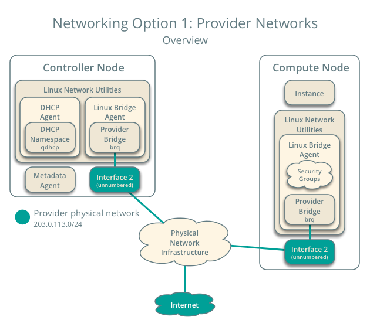
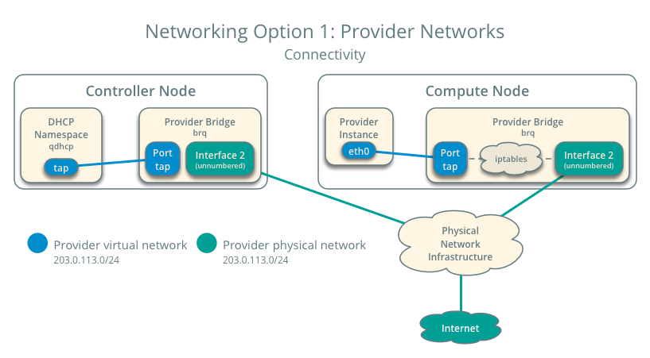

#### Provider network
在启动实例之前，必须创建必要的虚拟网络基础结构。对于连网选项1，实例使用provider (external) 网络，它通过2层网络(bridging/switching)连接到物理网络基础设施。这个网络包括一个DHCP服务器，它为实例提供IP地址。
管理员或其他特权用户必须创建这个网络，因为它直接连接到物理网络基础结构。

> 所使用的为示例IP,需要根据自己的环境进行改变


*Networking Option 1: Provider networks - Overview*


*Networking Option 1: Provider networks - Connectivity*

#### Create the provider network

1. 在controller节点上, source admin的验证脚本以获取权限admin-only CLI commands:

```
$ . admin-openrc
```
2. 创建网络

```
$ openstack network create  --share --external \
  --provider-physical-network provider \
  --provider-network-type flat provider

Created a new network:

+---------------------------+--------------------------------------+
| Field                     | Value                                |
+---------------------------+--------------------------------------+
| admin_state_up            | UP                                   |
| availability_zone_hints   |                                      |
| availability_zones        |                                      |
| created_at                | 2017-03-14T14:37:39Z                 |
| description               |                                      |
| dns_domain                | None                                 |
| id                        | 54adb94a-4dce-437f-a33b-e7e2e7648173 |
| ipv4_address_scope        | None                                 |
| ipv6_address_scope        | None                                 |
| is_default                | None                                 |
| mtu                       | 1500                                 |
| name                      | provider                             |
| port_security_enabled     | True                                 |
| project_id                | 4c7f48f1da5b494faaa66713686a7707     |
| provider:network_type     | flat                                 |
| provider:physical_network | provider                             |
| provider:segmentation_id  | None                                 |
| qos_policy_id             | None                                 |
| revision_number           | 3                                    |
| router:external           | External                             |
| segments                  | None                                 |
| shared                    | True                                 |
| status                    | ACTIVE                               |
| subnets                   |                                      |
| updated_at                | 2017-03-14T14:37:39Z                 |
+---------------------------+--------------------------------------+
```

--share 选项允许所有的项目使用虚拟网络

--external 选项将虚拟网络定义为external。 如果想创建internal网络,可以使用 --internal instead. 默认值为internal。

--provider-physical-network provider 及 --provider-network-type flat 选项连接虚拟网络至flat(native/untagged)， eth1网络接口的物理网络，在以下文件中

ml2_conf.ini:

```
[ml2_type_flat]
flat_networks = provider
```

linuxbridge_agent.ini:
```
[linux_bridge]
physical_interface_mappings = provider:eth1
```
>创建了一个网络

3. 创建子网
```
openstack subnet create \
 --network provider \
 --allocation-pool start=START_IP_ADDRESS,end=END_IP_ADDRESS \
 --dns-nameserver DNS_RESOLVER \
 --gateway PROVIDER_NETWORK_GATEWAY \
 --subnet-range PROVIDER_NETWORK_CIDR provider
```

Replace PROVIDER_NETWORK_CIDR with the subnet on the provider physical network in CIDR notation.

将 START_IP_ADDRESS 和 END_IP_ADDRESS 替换为第一个和最后一个IP地址， 为要为实例分配的子网范围。此范围不能包含任何现有的活动IP地址。

将 DNS_RESOLVER 替换为 DNS 的IP地址. 在多数情况下, you can use one from the /etc/resolv.conf file on the host.

替换 PROVIDER_NETWORK_GATEWAY 替换为provider network网管地址，typically the “.1” IP address.

**Example**
 provider network 使用 203.0.113.0/24, 网关为203.0.113.1. DHCP server assigns each instance an IP地址范围为从203.0.113.101 至 203.0.113.250。 所有的实例使用8.8.4.4作为DNS。

 ```
 $ openstack subnet create \
  --network provider \
  --allocation-pool start=203.0.113.101,end=203.0.113.250 \
  --dns-nameserver 8.8.4.4 --gateway 203.0.113.1 \
  --subnet-range 203.0.113.0/24 provider

Created a new subnet:
+-------------------+--------------------------------------+
| Field             | Value                                |
+-------------------+--------------------------------------+
| allocation_pools  | 203.0.113.101-203.0.113.250          |
| cidr              | 203.0.113.0/24                       |
| created_at        | 2017-03-29T05:48:29Z                 |
| description       |                                      |
| dns_nameservers   | 8.8.4.4                              |
| enable_dhcp       | True                                 |
| gateway_ip        | 203.0.113.1                          |
| host_routes       |                                      |
| id                | e84b4972-c7fc-4ce9-9742-fdc845196ac5 |
| ip_version        | 4                                    |
| ipv6_address_mode | None                                 |
| ipv6_ra_mode      | None                                 |
| name              | provider                             |
| network_id        | 1f816a46-7c3f-4ccf-8bf3-fe0807ddff8d |
| project_id        | 496efd248b0c46d3b80de60a309177b5     |
| revision_number   | 2                                    |
| segment_id        | None                                 |
| service_types     |                                      |
| subnetpool_id     | None                                 |
| updated_at        | 2017-03-29T05:48:29Z                 |
+-------------------+--------------------------------------+
 ```
>openstack subnet create \
--network provider \
--allocation-pool start=192.168.125.210,end=192.168.125.240 \
--dns-nameserver 159.226.8.7 --gateway 192.168.125.254 \
--subnet-range 192.168.125.0/24 provide


*tapd2701667-65*: flags=4163<UP,BROADCAST,RUNNING,MULTICAST>  mtu 1500
        ether 82:cb:2b:67:dd:dd  txqueuelen 1000  (Ethernet)
        RX packets 206  bytes 23676 (23.1 KiB)
        RX errors 0  dropped 0  overruns 0  frame 0
        TX packets 1494  bytes 153854 (150.2 KiB)
        TX errors 0  dropped 0 overruns 0  carrier 0  collisions 0


查看linux网桥

bridge name	bridge id		STP enabled	interfaces

brqc39f867c-60		8000.82cb2b67dddd	no		enp130s0f0
							*tapd2701667-65*


创建一个网桥，其连接一个新建的tap 和 物理网卡
创建一个名为 *tapd2701667-65* 的tap ,同时将其加入命名空间中

查看命名空间：
```
$ip netns exec qdhcp-c39f867c-6039-41e7-97a6-22ace2e3c425 ip link list
```

1: lo: <LOOPBACK,UP,LOWER_UP> mtu 65536 qdisc noqueue state UNKNOWN mode DEFAULT qlen 1
    link/loopback 00:00:00:00:00:00 brd 00:00:00:00:00:00
2: *ns-d2701667-65@if22*: <BROADCAST,MULTICAST,UP,LOWER_UP> mtu 1500 qdisc noqueue state UP mode DEFAULT qlen 1000
    link/ether fa:16:3e:a4:60:be brd ff:ff:ff:ff:ff:ff link-netnsid 0


查看命名空间内网络结构

```
$ip netns exec qdhcp-c39f867c-6039-41e7-97a6-22ace2e3c425 ifconfig
```

lo: flags=73<UP,LOOPBACK,RUNNING>  mtu 65536
        inet 127.0.0.1  netmask 255.0.0.0
        inet6 ::1  prefixlen 128  scopeid 0x10<host>
        loop  txqueuelen 1  (Local Loopback)
        RX packets 0  bytes 0 (0.0 B)
        RX errors 0  dropped 0  overruns 0  frame 0
        TX packets 0  bytes 0 (0.0 B)
        TX errors 0  dropped 0 overruns 0  carrier 0  collisions 0

*ns-d2701667-65*: flags=4163<UP,BROADCAST,RUNNING,MULTICAST>  mtu 1500
        inet 169.254.169.254  netmask 255.255.0.0  broadcast 169.254.255.255
        inet6 fe80::f816:3eff:fea4:60be  prefixlen 64  scopeid 0x20<link>
        ether fa:16:3e:a4:60:be  txqueuelen 1000  (Ethernet)
        RX packets 71  bytes 7850 (7.6 KiB)
        RX errors 0  dropped 0  overruns 0  frame 0
        TX packets 5  bytes 438 (438.0 B)
        TX errors 0  dropped 0 overruns 0  carrier 0  collisions 0
