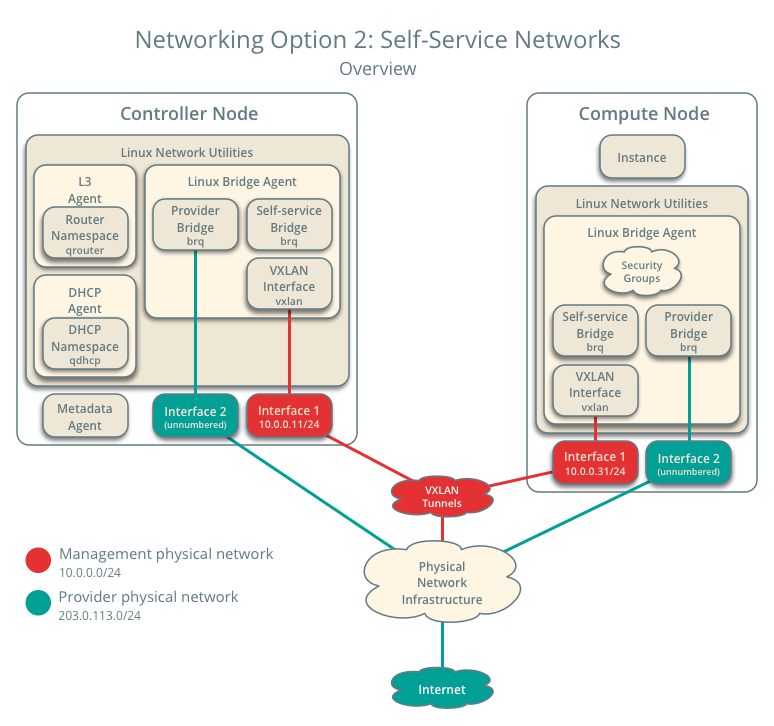
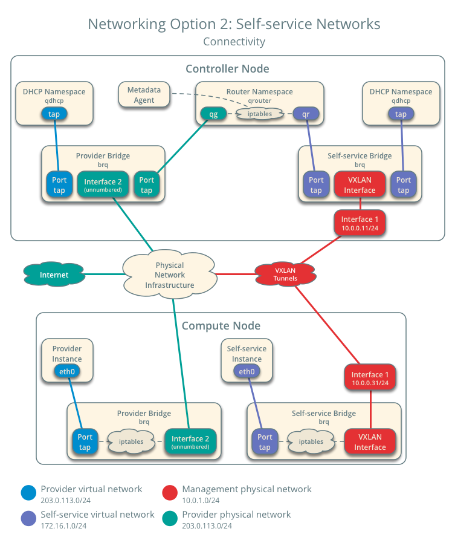

#### Self-service network

>先创建provide 网络

如果选择networking选项2，还可以创建一个self-service (private) 网络，通过NAT连接到物理网络基础设施。 这个网络包括一个DHCP服务器，它为实例提供IP地址。这个网络上的实例可以自动访问外部网络，如Internet。但是，从外部网络(如Internet)访问此网络上的实例需要一个浮动IP地址。
demo或其他非特权用户可以创建这个网络，*因为它只提供对demo项目中的实例的连接*。



*Networking Option 2: Self-service networks - Overview*

***


*Networking Option 2: Self-service networks - Connectivity*

#### Create the self-service network

1. 在controller节点上, 使demo获取user-only CLI 命令权限
```
$ . demo-openrc
```
2. 创建网络

```
$ openstack network create selfservice

Created a new network:
+-------------------------+--------------------------------------+
| Field                   | Value                                |
+-------------------------+--------------------------------------+
| admin_state_up          | UP                                   |
| availability_zone_hints |                                      |
| availability_zones      |                                      |
| created_at              | 2016-11-04T18:20:59Z                 |
| description             |                                      |
| headers                 |                                      |
| id                      | 7c6f9b37-76b4-463e-98d8-27e5686ed083 |
| ipv4_address_scope      | None                                 |
| ipv6_address_scope      | None                                 |
| mtu                     | 1450                                 |
| name                    | selfservice                          |
| port_security_enabled   | True                                 |
| project_id              | 3828e7c22c5546e585f27b9eb5453788     |
| project_id              | 3828e7c22c5546e585f27b9eb5453788     |
| revision_number         | 3                                    |
| router:external         | Internal                             |
| shared                  | False                                |
| status                  | ACTIVE                               |
| subnets                 |                                      |
| tags                    | []                                   |
| updated_at              | 2016-11-04T18:20:59Z                 |
+-------------------------+--------------------------------------+
```
>网络名称为selfservice

非特权用户通常不能为该命令提供额外的参数。服务使用以下文件中的信息自动选择参数:
ml2_conf.ini:
```
[ml2]
tenant_network_types = vxlan

[ml2_type_vxlan]
vni_ranges = 1:1000
```
3. 在网络上创建子网

```
$ openstack subnet create \
  --network selfservice \
  --dns-nameserver DNS_RESOLVER --gateway SELFSERVICE_NETWORK_GATEWAY \ --subnet-range SELFSERVICE_NETWORK_CIDR selfservice

```
替换 DNS_RESOLVER 为DNS resolver的IP 地址. In most cases, you can use one from the /etc/resolv.conf file on the host.

替换 SELFSERVICE_NETWORK_GATEWAY 为在self-service network 中想使用的网关，typically the “.1” IP address.

替换 SELFSERVICE_NETWORK_CIDR 为子网，之后使用在self-service网络上。您可以使用任意值,建议参考RFC 1918.

**Example**
 self-service network 使用 172.16.1.0/24 ，网关为 172.16.1.1 。 DHCP server 为每个实例分配一个IP地址，范围为172.16.1.2至172.16.1.254. 所有的示例使用8.8.4.4作为DNS解析地址.

```
openstack subnet create --network selfservice \
  --dns-nameserver 8.8.4.4 --gateway 172.16.1.1 \
  --subnet-range 172.16.1.0/24 selfservice

  Created a new subnet:
+-------------------+--------------------------------------+
| Field             | Value                                |
+-------------------+--------------------------------------+
| allocation_pools  | 172.16.1.2-172.16.1.254              |
| cidr              | 172.16.1.0/24                        |
| created_at        | 2016-11-04T18:30:54Z                 |
| description       |                                      |
| dns_nameservers   | 8.8.4.4                              |
| enable_dhcp       | True                                 |
| gateway_ip        | 172.16.1.1                           |
| headers           |                                      |
| host_routes       |                                      |
| id                | 5c37348e-e7da-439b-8c23-2af47d93aee5 |
| ip_version        | 4                                    |
| ipv6_address_mode | None                                 |
| ipv6_ra_mode      | None                                 |
| name              | selfservice                          |
| network_id        | b9273876-5946-4f02-a4da-838224a144e7 |
| project_id        | 3828e7c22c5546e585f27b9eb5453788     |
| project_id        | 3828e7c22c5546e585f27b9eb5453788     |
| revision_number   | 2                                    |
| service_types     | []                                   |
| subnetpool_id     | None                                 |
| updated_at        | 2016-11-04T18:30:54Z                 |
+-------------------+--------------------------------------+
```
> 增加一个命名空间
及一个vxlan-34


#### Create a router

self-service 使用虚拟路由器连接到provide网络，虚拟路由器通常执行双向NAT。每个路由器包含至少一个self-servic网络上的接口和provide网络上的网关。

provider网络必须包括路由器:  external选项使 self-service 路由器能够使用它连接到外部网络(如Internet)。
管理员或其他特权用户必须在网络创建期间包括此选项或稍后添加它。在这种情况下，router:external选项是在创建提供程序网络时使用——external参数设置的。

1. 同步环境变量

2. 创建路由
```
$ openstack router create router

Created a new router:
+-------------------------+--------------------------------------+
| Field                   | Value                                |
+-------------------------+--------------------------------------+
| admin_state_up          | UP                                   |
| availability_zone_hints |                                      |
| availability_zones      |                                      |
| created_at              | 2016-11-04T18:32:56Z                 |
| description             |                                      |
| external_gateway_info   | null                                 |
| flavor_id               | None                                 |
| headers                 |                                      |
| id                      | 67324374-396a-4db6-9443-c70be167a42b |
| name                    | router                               |
| project_id              | 3828e7c22c5546e585f27b9eb5453788     |
| project_id              | 3828e7c22c5546e585f27b9eb5453788     |
| revision_number         | 2                                    |
| routes                  |                                      |
| status                  | ACTIVE                               |
| updated_at              | 2016-11-04T18:32:56Z                 |
+-------------------------+--------------------------------------+
```
3. 添加 self-service 网络的子网作为接口 在 router上

```
$ openstack router add subnet router selfservice

```

4.  设置网关

```
openstack router set router --external-gateway provider

```

#### 验证操作
我们建议您在继续之前验证操作并修复任何问题。下面的步骤使用网络和子网创建示例中的IP地址范围。

1. 在controller节点上, source admin的验证脚本以获取权限admin-only CLI commands:

```
$ . admin-openrc
```

2. 列举 网络命名空间。您应该看到一个 qrouter命名空间 和 两个qdhcp命名空间。

```
$ ip netns

qrouter-89dd2083-a160-4d75-ab3a-14239f01ea0b
qdhcp-7c6f9b37-76b4-463e-98d8-27e5686ed083
qdhcp-0e62efcd-8cee-46c7-b163-d8df05c3c5ad

```

3. 列出路由器上的端口，以确定provider network网络上的网关IP地址:
```
$ openstack port list --router router

+--------------------------------------+------+-------------------+-------------------------------------------------------------------------------+--------+
| ID                                   | Name | MAC Address       | Fixed IP Addresses                                                            | Status |
+--------------------------------------+------+-------------------+-------------------------------------------------------------------------------+--------+
| bff6605d-824c-41f9-b744-21d128fc86e1 |      | fa:16:3e:2f:34:9b | ip_address='172.16.1.1', subnet_id='3482f524-8bff-4871-80d4-5774c2730728'     | ACTIVE |
| d6fe98db-ae01-42b0-a860-37b1661f5950 |      | fa:16:3e:e8:c1:41 | ip_address='203.0.113.102', subnet_id='5cc70da8-4ee7-4565-be53-b9c011fca011'  | ACTIVE |
+--------------------------------------+------+-------------------+-------------------------------------------------------------------------------+--------+
```

4. 从控制器节点或任何主机Ping此IP地址:

```
$ ping -c 4 203.0.113.102

PING 203.0.113.102 (203.0.113.102) 56(84) bytes of data.
64 bytes from 203.0.113.102: icmp_req=1 ttl=64 time=0.619 ms
64 bytes from 203.0.113.102: icmp_req=2 ttl=64 time=0.189 ms
64 bytes from 203.0.113.102: icmp_req=3 ttl=64 time=0.165 ms
64 bytes from 203.0.113.102: icmp_req=4 ttl=64 time=0.216 ms

--- 203.0.113.102 ping statistics ---
rtt min/avg/max/mdev = 0.165/0.297/0.619/0.187 ms\

```
