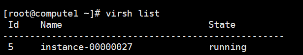
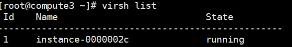

### 测试环境

| 节点名称 |  主机名称  | manage IP      | provider IP |安装服务|
|:-------:|:---------:|:--------------:|:----------: |
|控制节点  | controller|192.168.125.123 | 10.19.19.23 |glance,keystone,nova,neutron,cinder|
|计算节点1 |   compute1|192.168.125.125 | 10.19.19.25 |nova,neutron,cinder|
|计算节点2 |   compute2|192.168.125.113 | 10.19.19.13 |nova,neutron|
|计算节点3 |   compute3|192.168.125.119 | 10.19.19.119|nova,neutron|

系统：ubuntu16.04
内存：4G
vcpu:4

##### 单台服务器最多可以起多少台虚拟机，在保证每台虚拟机满足基本性能要求的情况下可以起多少台虚拟机？

##### 虚拟机之间的网络通信带宽

| 虚拟机名称 | 所在节点 | virsh 名称       |  网络地址        |网络类型 |
|:---------:|:-------:|:----------------:|:--------------: |:------:|
|ubuntu2    | compute1| instance-00000027| 192.168.125.221 |provider|
|ubuntu3    | compute3| instance-0000002c| 192.168.125.217 |provider|
|ubuntu1    | compute3| instance-0000002d| 192.168.125.213 |provider|

###### 同服务器内，同网络云主机之间的

* 跨服务器的，同网络云主机之间的

在compute1上创建实例为

在compute3上创建实例为

* 不同网络，同服务器，经过路由器的

* 不同网络，不同服务器，经过路由器的

* 通过浮动IP，个人电脑与云主机之间的

* 物理云主机与云主机之间的

##### 创建云主机时间
