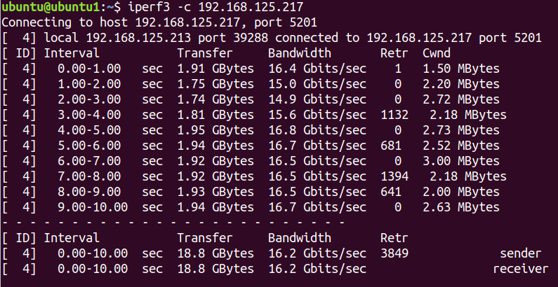
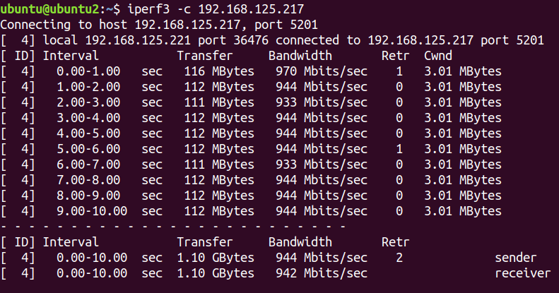
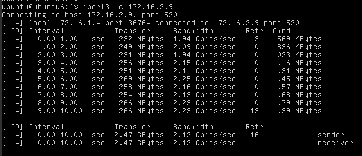
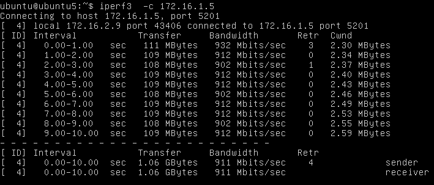
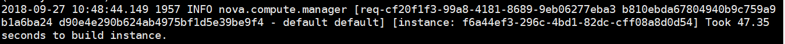

####  测试环境

| 节点名称 |  主机名称  | manage IP      | provider IP |安装服务|
|:-------:|:---------:|:--------------:|:----------: |:----------: |
|控制节点  | controller|192.168.125.123 | 10.19.19.23 |glance,keystone,nova,neutron,cinder|
|计算节点1 |   compute1|192.168.125.125 | 10.19.19.25 |nova,neutron,cinder|
|计算节点2 |   compute2|192.168.125.113 | 10.19.19.13 |nova,neutron|
|计算节点3 |   compute3|192.168.125.119 | 10.19.19.119|nova,neutron|

#### 单台服务器最多可以起多少台虚拟机

openstack默认配置为可以创建10 个实例，可以修改nova.conf配置，设置虚拟机数量限制。

#### 虚拟机之间的网络通信带宽

创建测试实例如下：

|名称   | 所在节点 | virsh 名称       |  网络地址        |网络类型 |浮动IP    |
|:-----:|:-------:|:----------------:|:--------------: |:------:|:---------:|
|ubuntu2|compute1| instance-00000027| 192.168.125.221 |provider|none       |
|ubuntu3|compute3| instance-0000002c| 192.168.125.217 |provider|none       |
|ubuntu1|compute3| instance-0000002d| 192.168.125.213 |provider|none       |
|ubuntu4|compute3| instance-0000002e| 	172.16.1.5    |self    |none       |
|ubuntu5|compute1| instance-0000002f| 	172.16.2.9    |self    |none       |
|ubuntu6|compute1| instance-00000030| 	172.16.1.4    |self    |192.168.125.211|
|ubuntu7|compute1| instance-00000031| 	172.16.1.8    |self    |192.168.125.224|

实例配置
  * 系统：ubuntu16.04
  * 内存：4G
  * vcpu:4

##### 同服务器内，同网络云主机之间的

测试ubuntu1与ubuntu3之间的带宽，以ubuntu3作为iperf3服务器

##### 跨服务器的，同网络云主机之间的

测试ubuntu4与ubuntu3之间带宽，以ubuntu3作为iperf3服务器

##### 不同网络，同服务器，经过路由器的

ubuntu5与ubuntu6之间，以ubuntu5作为iperf3服务器

##### 不同网络，不同服务器，经过路由器的

测试Ubuntu4和Ubuntu5之间的带宽，以ubuntu4作为iperf3服务器

##### 通过浮动IP，个人电脑与云主机之间的
测试Ubuntu6的浮动IP与本地192.168.122.146之间的带宽
iperf3服务器无法连接，可以ping通

##### 物理云主机与云主机之间的

测试Ubuntu6与Ubuntu7 虚拟机之间的网络通信带宽。
iperf3服务器无法连接，可以ping通

#### 创建云主机时间

查看nova日志，创建实例时间为47秒

