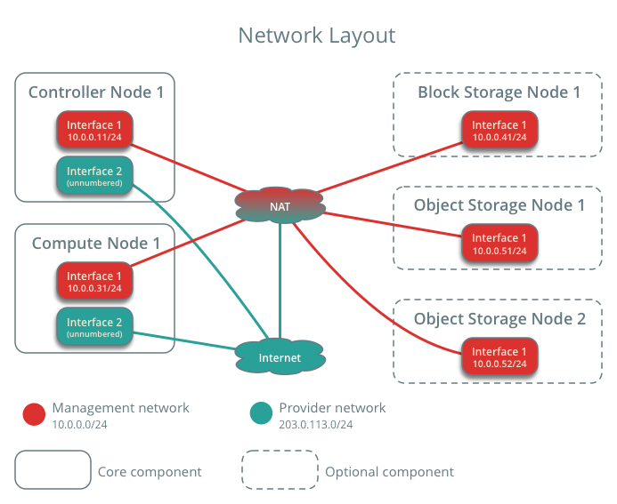
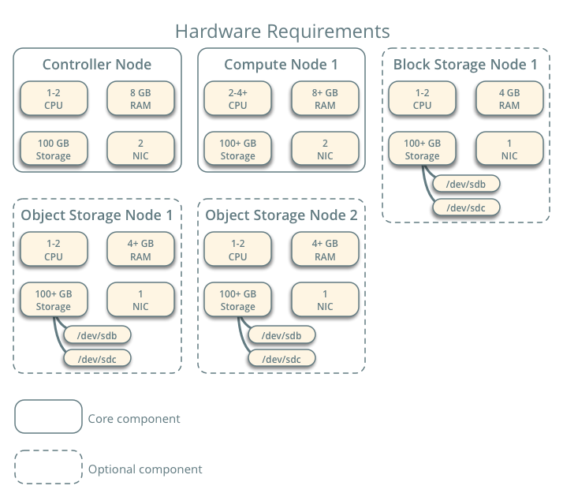

https://docs.openstack.org/install-guide/openstack-services.html

利用Devstack 可以安装快速openstack，但为了更好的理清openstack，本文使用手动安装。
参考[](https://docs.openstack.org/install-guide/)
安装版本为**Queue** 版本，最小的openstack需安装以下组件：

*   Identity service – [keystone installation for Queens](https://docs.openstack.org/keystone/queens/install/)
*   Image service – [glance installation for Queens](https://docs.openstack.org/glance/queens/install/)
*   Compute service – [nova installation for Queens](https://docs.openstack.org/nova/queens/install/)
*   Networking service – [neutron installation for Queens](https://docs.openstack.org/neutron/queens/install/)

建议安装的软件包为：

*   Dashboard – [horizon installation for Queens](https://docs.openstack.org/horizon/queens/install/)
*   Block Storage service – [cinder installation for Queens](https://docs.openstack.org/cinder/queens/install/)

### 安装环境

#### 安全

**Passwords**
| Password name | Description|
|:-------------:|:----------:|
|ADMIN_PASS     |Password of user admin|
|CINDER_DBPASS	|Database password for the Block Storage service|
|CINDER_PASS	  |Password of Block Storage service user cinder|
|DASH_DBPASS	  |Database password for the Dashboard|
|DEMO_PASS	    |Password of user demo|
|GLANCE_DBPASS	|Database password for Image service|
|GLANCE_PASS	  |Password of Image service user glance|
|KEYSTONE_DBPASS|	Database password of Identity service|
|METADATA_SECRET|	Secret for the metadata proxy|
|NEUTRON_DBPASS	|Database password for the Networking service
|NEUTRON_PASS	  |Password of Networking service user neutron|
|NOVA_DBPASS	  |Database password for Compute service|
|NOVA_PASS	   |Password of Compute service user nova|
|PLACEMENT_PASS|	Password of the Placement service user placement|
|RABBIT_PASS	 |Password of RabbitMQ user openstack|
#### Host networking
在为您选择部署的体系结构在每个节点上安装操作系统之后，您必须配置网络接口。我们建议您禁用任何自动化网络管理工具，并手动编辑适合您的发行版的配置文件。
#### 设置主机名及IP
所有节点都需要Internet访问用于管理，例如包安装、安全更新、DNS和NTP。在大多数情况下，节点应该通过管理网络接口(management network interface)获得Internet访问。

为了强调网络分离的重要性，示例体系结构使用管理网络的私有地址空间，并假设物理网络基础结构通过NAT或其他方法提供Internet访问。示例体系结构为提供者(外部)网络使用可路由的IP地址空间，并假设物理网络基础设施提供了直接的Internet访问。在provider网络结构中, 所有的示例均直接连接在provider网络上. 在 self-service (private) 网络结构中,示例可以 连接到self-service网络或provider网络. Self-service网络可以完全驻留在OpenStack中，或者通过提供者网络使用NAT提供某种程度的外部网络访问。


示例结构使用一下网络配置：
* Management on 10.0.0.0/24 with gateway 10.0.0.1
这个网络为所有节点提供Internet网络访问，均可以管理软件包，安全更新，DNS和NTP。


* Provider on 203.0.113.0/24 with gateway 203.0.113.1

这个网络需要一个网关来提供对OpenStack环境中的实例的Internet访问。

controller节点的management网卡，设为10.0.0.11。


1. vim /etc/hosts

```
IP   controller
```
即 "IP地址，域名，主机名"
**其中域名可以省略，不要删除127.0.0.1项**
```
# controller
10.19.19.13       controller

# compute1
10.19.19.23       compute1

# compute2
10.19.19.25       compute2
```


#### 网络时间同步协议(NTP)

#####控制节点

以下命令在控制节点上执行

1. 安装包
```
yum install chrony
```

2. vim /etc/chrony.conf 文件中写入以下内容

```
server NTP_SERVER iburst
```

NTP_SERVER 为主机名或IP地址
> *server 192.168.125.115 iburst*


>其他节点：server controller iburst

3. 保证其他服务节点可以访问控制节点的chrony daemon,需要在同一个chrony.conf文件中写入以下内容

```
allow 10.0.0.0/24
```
将10.0.0.0/24　替换为相对的子网
> *allow 192.168.125.0/24*

４．重启NT服务

```
systemctl enable chronyd.service
systemctl start chronyd.service
```

##### 其他节点
1. 安装包
```
 yum install chrony
```
2. 配置chrony.conf 文件并注释掉或删除除一个服务器密钥之外的所有密钥。
将其更改为引用控制器节点。vim /etc/chrony.conf
```
server controller iburst
```
3. 将 iburst line 中的pool 2.debian.pool.ntp.org 注释掉 iburst line.
4. 重启服务

```
# systemctl enable chronyd.service
# systemctl start chronyd.service
```

#### 安装openstack相关包
在所有节点运行以下命令

1. 安装包
* centos
```
yum install centos-release-openstack-queens -y
```

* RHEL
```
yum install https://rdoproject.org/repos/rdo-release.rpm
```

2. 更新软件包
```
yum upgrade
```

3. 安装OpenStack client

```
yum install python-openstackclient -y
```

4. RHEL and CentOS 默认启动了SELinux，安装openstack-selinux为openstack安全策略进行管理

```
yum install openstack-selinux
```

#### SQL 数据库
大多数OpenStack服务使用SQL数据库来存储信息。数据库通常在controller节点上运行。本指南中使用MariaDB。

1. 安装相应软件包

```
yum install mariadb mariadb-server python2-PyMySQL
```
2. vim /etc/my.cnf.d/openstack.cnf文件，并新增[mysql]字段，并将bind-address设置为管理节点地址，并将编码方式设置未utf8,修改内容如下

```
[mysqld]
# 监听地址,0.0.0.0设置为全部可以监听
# 可以设置未controller的IP地址
bind-address = 0.0.0.0

# 默认存储引擎innodb
default-storage-engine = innodb

# 设置独享的表空间，如果不设置，会是共享表空间
innodb_file_per_table = on

# 最大连接数
max_connections = 4096

# 校对规则
collation-server = utf8_general_ci

# 数据库建库字符集
character-set-server = utf8
```

3. 启动服务，并设置为开机启动
```
＃ 设置为开机启动
systemctl enable mariadb.service

＃　启动服务
systemctl start mariadb.service

```

4. 执行mysql_secure_installation脚本设置安全属性，并为root帐号设置合适密码

```
mysql_secure_installation
```

[SQL database](https://docs.openstack.org/install-guide/environment-sql-database.html)


####　消息队列RabbitMQ
OpenStack使用消息队列来协调服务之间的操作和状态信息。
消息队列服务通常在 **控制器节点** 上运行。OpenStack支持多个消息队列服务，包括RabbitMQ、Qpid和ZeroMQ。但是，大多数penStack的发行版都支持特定的消息队列服务。因为大多数发行版均支持RabbitMQ消息队列服务，故安装RabbitMQ消息队列

1. 安装包

```
yum install rabbitmq-server
```

2. 启动消息队列并设置为开机启动

```
systemctl enable rabbitmq-server.service
systemctl start rabbitmq-server.service
```

3. 添加openstack用户

```
rabbitmqctl add_user openstack RABBIT_PASS
```

>RABBIT_PASS 替换为合适的密码

4. 许可设定，未openstack用户添加读写权限

```
rabbitmqctl set_permissions openstack ".*" ".*" ".*"
```

#### 安装Memcached

服务的身份服务身份验证机制使用Memcached缓存令牌。memcached服务通常在 **控制器节点** 上运行。

1. 安装相应软件包

```
yum install memcached python-memcached
```

2. vim /etc/sysconfig/memcached

确定服务使用的是controller节点的management　IP地址,以使其他节点可以通过management网络访问控制节点

```
OPTIONS="-l 127.0.0.1,::1,controller"
```
>更改之前的OPTIONS="-l 127.0.0.1,::1".


3. 开启Memcached服务并设为开机启动

```
systemctl enable memcached.service
systemctl start memcached.service
```

#### Etcd

OpenStack服务可以使用Etcd，这是一种分布式可靠的键值存储，用于分布式键锁定、存储配置、跟踪服务实时性和其他场景。
1. 安装相应软件包
```
yum install etcd
```
2. vim /etc/etcd/etcd.conf
并设置以下字段  ETCD_INITIAL_CLUSTER, ETCD_INITIAL_ADVERTISE_PEER_URLS, ETCD_ADVERTISE_CLIENT_URLS, ETCD_LISTEN_CLIENT_URLS．使其他节点可以连接值管理网络
```
#[Member]

ETCD_DATA_DIR="/var/lib/etcd/default.etcd"
ETCD_LISTEN_PEER_URLS="http://192.168.125.115:2380"
ETCD_LISTEN_CLIENT_URLS="http://192.168.125.115:2379"
ETCD_NAME="controller"
#[Clustering]
ETCD_INITIAL_ADVERTISE_PEER_URLS="http://192.168.125.115:2380"
ETCD_ADVERTISE_CLIENT_URLS="http://192.168.125.115:2379"
# 注意 = 
ETCD_INITIAL_CLUSTER="controller=http://192.168.125.115:2380"

ETCD_INITIAL_CLUSTER_TOKEN="etcd-cluster-01"
ETCD_INITIAL_CLUSTER_STATE="new"
```
其中192.168.125.115为控制节点的网络，需改成自己的IP地址

3. 启动服务
```
systemctl enable etcd
systemctl start etcd
```

### 概述


##### Controller
控制器节点运行身份服务、映像服务、计算的管理部分、网络的管理部分、各种网络代理和仪表板。它还包括SQL数据库、消息队列和网络时间协议(NTP)等支持服务。

控制器节点可选地运行部分块存储、对象存储、编排和遥测服务。

控制器节点至少需要两个网络接口。

##### Compute

计算节点运行运行实例的计算程序部分。默认情况下，Compute使用基于内核的VM (KVM)管理程序。计算节点还运行一个网络服务代理，该代理将实例连接到虚拟网络，并通过安全组向实例提供防火墙服务。

您可以部署多个计算节点。每个节点至少需要两个网络接口。


##### Object Storage
可选的对象存储节点包含对象存储服务用于存储帐户、容器和对象的磁盘。

为了简单起见，计算节点和此节点之间的服务通信使用管理网络。生产环境应该实现单独的存储网络，以提高性能和安全性。

这个服务需要两个节点。每个节点至少需要一个网络接口。您可以部署两个以上的对象存储节点。


##### Networking


[中文文档](https://docs.openstack.org/liberty/zh_CN/install-guide-rdo/common/conventions.html)
