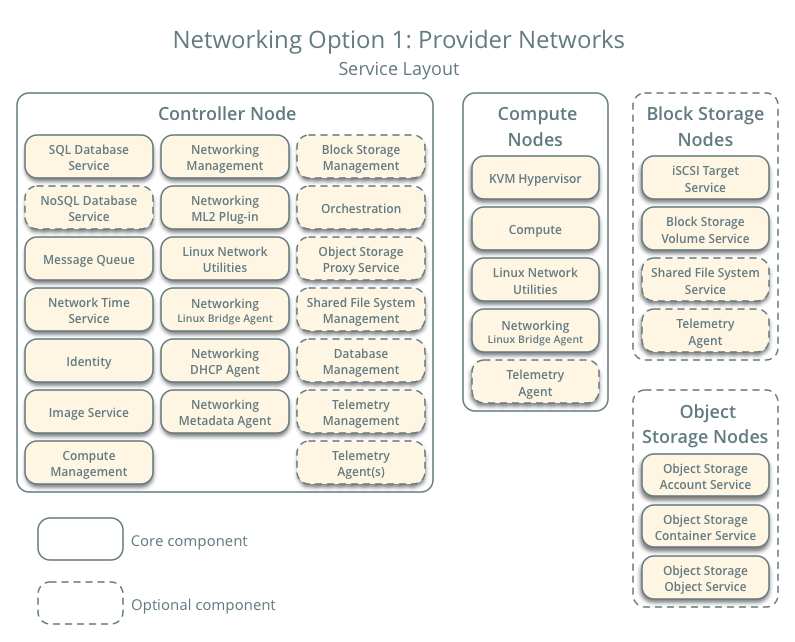
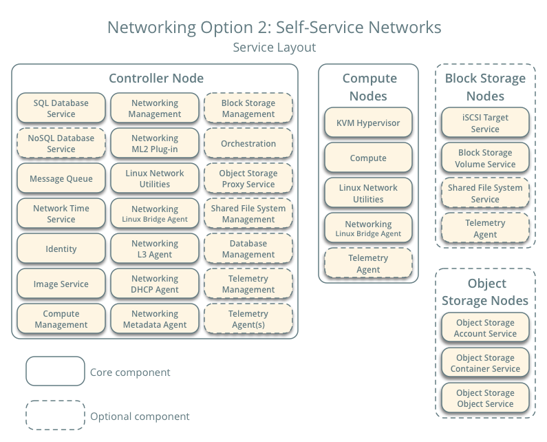
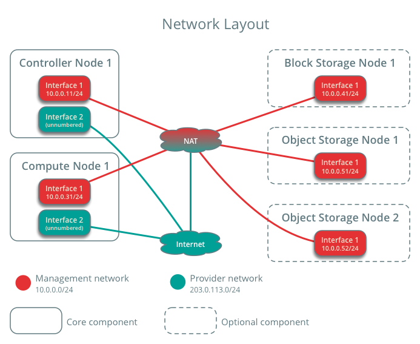

### 安装neutron
### Overview
OpenStack项目是一个开源的云计算平台，支持所有类型的云环境。该项目旨在实现简单的实现、大规模的可伸缩性和丰富的特性集。来自世界各地的云计算专家为这个项目做出了贡献。

OpenStack通过各种补充服务提供了一个基础设施即服务(IaaS)解决方案。每个服务都提供了一个应用程序编程接口(API)来促进这种集成。

本指南介绍了使用适合具有足够Linux经验的OpenStack新用户的功能示例体系结构逐步部署主要OpenStack服务的过程。本指南不打算用于生产系统安装，而是创建一个最小的概念验证，以学习OpenStack。
在熟悉了这些OpenStack服务的基本安装、配置、操作和故障排除之后，您应该考虑使用生产体系结构进行部署的以下步骤:

Determine and implement the necessary core and optional services to meet performance and redundancy requirements.
Increase security using methods such as firewalls, encryption, and service policies.
Implement a deployment tool such as Ansible, Chef, Puppet, or Salt to automate deployment and management of the production environment.
### Example architecture
### Networking
#### Networking Option 1: Provider networks
提供者网络选项以最简单的方式部署OpenStack网络提供者网络选项以最简单的方式部署OpenStack网络服务，主要使用层2(桥接/交换)服务和网络的VLAN分割。从本质上讲，它将虚拟网络连接到物理网络，并依赖物理网络基础设施提供第三层(路由)服务。此外，DHCP服务向实例提供IP地址信息。
OpenStack用户需要更多关于底层的信息


#### Networking Option 2: Self-service networks
Self-service网络选项通过层3(路由)服务增强了提供者网络选项，这些层3(路由)服务支持使用覆盖分割方法(如虚拟可扩展LAN)的自助服务网络。本质上，它使用网络地址转换(NAT)将虚拟网络路由到物理网络。此外，此选项为高级服务(如LBaaS和FWaaS)提供了基础。

OpenStack用户可以在不了解数据网络基础设施的情况下创建虚拟网络。如果相应地配置了layer-2插件，这还可以包括VLAN网络。


### Contents

OpenStack网络（neutron）管理您OpenStack环境中虚拟网络基础设施（VNI）所有网络方面和物理网络基础设施（PNI）的接入层方面。OpenStack网络允许租户创建包括像 firewall， :term:`load balancer`和 :term:`virtual private network (VPN)`等这样服务的高级网络虚拟拓扑。

网络提供网络，子网和路由作为对象抽象的概念。每个概念都有自己的功能，可以模拟对应的物理对应设备：网络包括子网，路由在不同的子网和网络间进行路由转发。

每个路由都有一个连接到网络的网关，并且很多接口都连接到子网中。子网可以访问其他连接到相同路由其他子网的机器。

任何给定的Networking设置至少有一个外部网络。不像其他的网络，外部网络不仅仅是一个虚拟定义的网络。相反,它代表了一种OpenStack安装之外的能从物理的，外部的网络访问的视图。外部网络上的IP地址能被任何物理接入外面网络的人所访问。因为外部网络仅仅代表了进入外面网络的一个视图，网络上的DHCP是关闭的。

外部网络之外，任何 Networking 设置拥有一个或多个内部网络。这些软件定义的网络直接连接到虚拟机。仅仅在给定网络上的虚拟机，或那些在通过接口连接到相近路由的子网上的虚拟机，能直接访问连接到那个网络上的虚拟机。

如果外网需要访问虚拟机，或者相反，网络中的路由器就是必须要使用的。每个路由器配有一个网关，可以连接到网络和接口，这些接口又连接着子网。如同实体路由器一样，子网中的机器可以访问连接到同一个路由器的子网中的其它机器，机器可以通过该路由器的网关访问外网。

另外，你可以将外部网络的IP地址分配给内部网络的端口。不管什么时候一旦有什么连接到子网，那个连接就叫做端口。你可以通过端口把外部网络IP地址分给VMs。

网络同样支持*security groups*。安全组允许管理员在安全组中定义防火墙规则。一个VM可以属于一个或多个安全组，网络为这个VM应用这些安全组中的规则，阻止或者开启端口，端口范围或者通信类型。

每一个Networking使用的插件都有其自有的概念。虽然对操作VNI和OpenStack环境不是至关重要的，但理解这些概念能帮助你设置Networking。所有的Networking安装使用了一个核心插件和一个安全组插件(或仅是空操作安全组插件)。另外，防火墙即服务(FWaaS)和负载均衡即服务(LBaaS)插件是可用的。

####选项1 Provider networks
提供者网络选项以最简单的方式部署OpenStack网络服务，主要使用层2(桥接/交换)服务和网络的VLAN分割。

从本质上讲，它将虚拟网络连接到物理网络，并依赖物理网络基础设施提供第三层(路由)服务。

此外，DHCP服务向实例提供IP地址信息。

OpenStack用户需要关于底层网络基础结构的更多信息来创建一个虚拟网络来精确匹配基础结构。


####选项2 Self-service networks
 Self-service网络选项通过层3(路由)服务增强了提供者网络选项，这些层3(路由)服务支持使用覆盖分割方法(如虚拟可扩展LAN)的自助服务网络。本质上，它使用网络地址转换(NAT)将虚拟网络路由到物理网络。此外，此选项为高级服务(如LBaaS和FWaaS)提供了基础。

OpenStack用户可以在不了解数据网络基础设施的情况下创建虚拟网络。如果相应地配置了layer-2插件，这还可以包括VLAN网络。


#### Networking (neutron) concepts
OpenStack网络(neutron)管理着OpenStack环境中虚拟网络基础设施(VNI)和物理网络基础设施(PNI)的访问层的所有网络方面。OpenStack网络使项目能够创建高级虚拟网络拓扑，其中可能包括防火墙、负载均衡器和虚拟专用网(VPN)等服务。
网络提供网络、子网和路由器作为对象抽象。每个抽象都具有模拟物理对等物的功能:网络包含子网，路由器在不同子网和网络之间路由通信。
任何给定的网络设置至少有一个外部网络。与其他网络不同的是，外部网络不仅仅是一个虚拟定义的网络。相反，它代表了在OpenStack安装之外可以访问的物理外部网络的一个视图。外部网络上的IP地址任何人都可以通过外部网络访问。

除了外部网络之外，任何建立的网络都有一个或多个内部网络。这些软件定义的网络直接连接到vm。只有任何给定的内部网络上的vm，或通过接口连接到类似路由器的子网上的vm，才能直接访问连接到该网络的vm。
外部网络要访问vm，反之亦然，需要网络之间的路由器。每个路由器都有一个连接到外部网络的网关和一个或多个连接到内部网络的接口。像物理路由器一样，子网可以访问连接到同一路由器的其他子网上的机器，而机器可以通过路由器的网关访问外部网络。

此外，您可以将外部网络上的IP地址分配给内部网络上的端口。无论什么时候连接到子网，这个连接就叫做端口。您可以将外部网络IP地址与到vm的端口相关联。通过这种方式，外部网络上的实体可以访问vm。
网络还支持安全组。安全组允许管理员在组中定义防火墙规则。VM可以属于一个或多个安全组，网络应用这些安全组中的规则来阻塞或解除对VM的端口、端口范围或流量类型的阻塞。
网络使用的每个插件都有自己的概念。虽然对于操作VNI和OpenStack环境并不重要，但是理解这些概念可以帮助您建立网络。所有网络安装都使用一个核心插件和一个安全组插件(或者仅仅是No-Op安全组插件)。此外，还可以使用Firewall-as-a-Service (FWaaS)和Load-Balancer-as-a-Service (LBaaS)插件。

#### Host networking
在为您选择部署的体系结构在每个节点上安装操作系统之后，您必须配置网络接口。我们建议您禁用任何自动化网络管理工具，并手动编辑适合您的发行版的配置文件。有关如何在发行版上配置网络的更多信息，请参阅SLES 12或openSUSE文档。

所有节点都需要Internet访问，用于管理目的，例如包安装、安全更新、域名系统(DNS)和网络时间协议(NTP)。在大多数情况下，节点应该通过 *management network* 接口获得Internet访问。为了强调网络分离的重要性，示例体系结构使用管理网络的私有地址空间，并假设物理网络基础设施通过网络地址转换(NAT)或其他方法提供Internet访问。示例体系结构为提供者(外部)网络使用可路由的IP地址空间，并假设物理网络基础设施提供了直接的Internet访问。

在Provider网络体系结构中，所有实例都直接连接到提供者网络。在Self-service(私有)网络体系结构中，实例可以附加到自助服务或Provider网络。Self-service网络可以完全驻留在OpenStack中，或者通过提供者网络使用网络地址转换(NAT)提供某种程度的外部网络访问。




示例结构如下

    管理网络在10.0.0.0/24 网关为 10.0.0.1

    This network requires a gateway to provide Internet access to all nodes for administrative purposes such as package installation, security updates, Domain Name System (DNS), and Network Time Protocol (NTP).

    Provider 在 203.0.113.0/24 网关为  203.0.113.1

    This network requires a gateway to provide Internet access to instances in your OpenStack environment.


您可以修改这些范围和网关来与您特定的网络基础设施一起工作。

网络接口名称因分布而异。传统上，接口使用eth，后面跟着一个序号。为了涵盖所有的变体，本指南将第一个接口作为编号最低的接口，第二个接口作为编号最高的接口。

除非您打算使用本例体系结构中提供的精确配置，否则您必须修改此过程中的网络以匹配您的环境。除了IP地址之外，每个节点必须通过名称解析其他节点。
例如，控制节点名称必须解析为10.0.0.11，即控制器节点的management network的IP地址。


#####　安装必备条件

1. 创建数据库
* 登录数据库
```
mysql -u root -p
```
* 创建neutron数据库
```
MariaDB [(none)] CREATE DATABASE neutron;
```

* 设置登录数据库的权限

```
MariaDB [(none)]> GRANT ALL PRIVILEGES ON neutron.* TO 'neutron'@'localhost' \
  IDENTIFIED BY 'NEUTRON_DBPASS';

MariaDB [(none)]> GRANT ALL PRIVILEGES ON neutron.* TO 'neutron'@'%' \
  IDENTIFIED BY 'NEUTRON_DBPASS';

```

2. 获取admin权限

```
. admin-openrc
```

3. 创建服务凭证

* 创建neutron用户:

```
$ openstack user create --domain default --password-prompt neutron

User Password:NEUTRON_PASS
Repeat User Password:
+---------------------+----------------------------------+
| Field               | Value                            |
+---------------------+----------------------------------+
| domain_id           | default                          |
| enabled             | True                             |
| id                  | fdb0f541e28141719b6a43c8944bf1fb |
| name                | neutron                          |
| options             | {}                               |
| password_expires_at | None                             |
+---------------------+----------------------------------+

```
* 为neutron添加admin角色用户

```
 openstack role add --project service --user neutron admin
```

* 创建neutron服务

```
$ openstack service create --name neutron \
  --description "OpenStack Networking" network

+-------------+----------------------------------+
| Field       | Value                            |
+-------------+----------------------------------+
| description | OpenStack Networking             |
| enabled     | True                             |
| id          | f71529314dab4a4d8eca427e701d209e |
| name        | neutron                          |
| type        | network                          |
+-------------+----------------------------------+
```

4. 创建网络服务API端点

```
$ openstack endpoint create --region RegionOne \
  network public http://controller:9696

+--------------+----------------------------------+
| Field        | Value                            |
+--------------+----------------------------------+
| enabled      | True                             |
| id           | 85d80a6d02fc4b7683f611d7fc1493a3 |
| interface    | public                           |
| region       | RegionOne                        |
| region_id    | RegionOne                        |
| service_id   | f71529314dab4a4d8eca427e701d209e |
| service_name | neutron                          |
| service_type | network                          |
| url          | http://controller:9696           |
+--------------+----------------------------------+

$ openstack endpoint create --region RegionOne \
  network internal http://controller:9696

+--------------+----------------------------------+
| Field        | Value                            |
+--------------+----------------------------------+
| enabled      | True                             |
| id           | 09753b537ac74422a68d2d791cf3714f |
| interface    | internal                         |
| region       | RegionOne                        |
| region_id    | RegionOne                        |
| service_id   | f71529314dab4a4d8eca427e701d209e |
| service_name | neutron                          |
| service_type | network                          |
| url          | http://controller:9696           |
+--------------+----------------------------------+

$ openstack endpoint create --region RegionOne \
  network admin http://controller:9696

+--------------+----------------------------------+
| Field        | Value                            |
+--------------+----------------------------------+
| enabled      | True                             |
| id           | 1ee14289c9374dffb5db92a5c112fc4e |
| interface    | admin                            |
| region       | RegionOne                        |
| region_id    | RegionOne                        |
| service_id   | f71529314dab4a4d8eca427e701d209e |
| service_name | neutron                          |
| service_type | network                          |
| url          | http://controller:9696           |
+--------------+----------------------------------+
```
5. 配置网络选项

可以使用选项1和2表示的两种体系结构之一来部署网络服务。
选项1：部署最简单的体系结构，只支持将实例附加到提供者(外部)网络。
没有自助(私有)网络、路由器或浮动IP地址。只有管理员或其他特权用户可以管理提供者网络。

选项2：选项2在选项1中增加了支持将实例附加到自助服务网络的第3层服务。
demo程序或其他非特权用户可以管理自助服务网络，包括提供自助服务和提供者网络之间连接的路由器。另外，浮动IP地址通过外部网络(如Internet)提供到使用自助服务网络的实例的连接。

Self-service网络通常使用覆盖网络。覆盖网络协议(如VXLAN)包括额外的头文件，增加开销并减少有效负载或用户数据的可用空间。在不了解虚拟网络基础结构的情况下，实例尝试使用默认的以太网最大传输单元(MTU)发送数据包，其大小为1500字节。
网络服务通过DHCP自动为实例提供正确的MTU值。但是，有些云映像不使用DHCP或忽略DHCP MTU选项，需要使用元数据或脚本进行配置。

***
**详细见**
[](./5_neutron_net2.md)

***

#####　配置metadata agent

*vim /etc/neutron/metadata_agent.ini* 文件，在[DEFAULT]字段

```
[DEFAULT]
# ...
nova_metadata_host = controller
metadata_proxy_shared_secret = METADATA_SECRET

```
Replace METADATA_SECRET with a suitable secret for the metadata proxy.

##### 配置 Compute service 以使用 Networking service

*vim /etc/nova/nova.conf* 文件，加入以下内容

```
[neutron]
# ...
url = http://controller:9696
auth_url = http://controller:35357
auth_type = password
project_domain_name = default
user_domain_name = default
region_name = RegionOne
project_name = service
username = neutron
password = NEUTRON_PASS
service_metadata_proxy = true
metadata_proxy_shared_secret = METADATA_SECRET
```


##### 结束安装并配置
1. 网络服务初始化脚本期望有一个符号链接/etc/neutron/plugin.ini指向ML2插件配置文件/etc/neutron/ plugins/ml2/ml2_con.ini。如果这个符号链接不存在，使用以下命令创建:
```
ln -s /etc/neutron/plugins/ml2/ml2_conf.ini /etc/neutron/plugin.ini
```

2. 同步数据库

```
su -s /bin/sh -c "neutron-db-manage --config-file /etc/neutron/neutron.conf \
  --config-file /etc/neutron/plugins/ml2/ml2_conf.ini upgrade head" neutron
```

3. 重启计算API服务

```
# systemctl restart openstack-nova-api.service
```

4. 开启网络服务，并设置其开机启动

```
# systemctl enable neutron-server.service \
 neutron-linuxbridge-agent.service neutron-dhcp-agent.service \
 neutron-metadata-agent.service

# systemctl start neutron-server.service \
 neutron-linuxbridge-agent.service neutron-dhcp-agent.service \
 neutron-metadata-agent.service
```
 针对网络选项2, 需要开启 layer-3 服务

 ```
# systemctl enable neutron-l3-agent.service

# systemctl start neutron-l3-agent.service
 ```


https://docs.openstack.org/neutron/queens/install/controller-install-rdo.html
